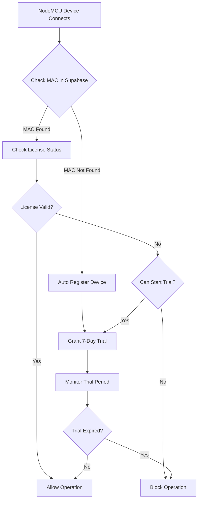

## 1. Product Overview

PISOWIFI Management System with NodeMCU License Verification - isang system para sa pag-manage ng Piso WiFi machines na may automatic license verification para sa NodeMCU devices. Ang system ay awtomatikong nagbibigay ng 7-day trial period para sa mga bagong NodeMCU devices na hindi pa rehistrado sa Supabase database.

## 2. Core Features

### 2.1 User Roles

| Role | Registration Method | Core Permissions |
|------|---------------------|------------------|
| Admin | Email registration via Supabase | Can manage NodeMCU devices, activate licenses, start trials |
| Superadmin | System assignment | Can generate license keys, manage all vendors |
| NodeMCU Device | Automatic MAC-based | Can connect and receive trial/licenses |

### 2.2 Feature Module

Ang system ay binubuo ng mga sumusunod na core modules:

1. **NodeMCU License Manager**: Dashboard para sa pag-manage ng licenses
2. **Device Registration**: Automatic MAC address detection at registration
3. **Trial System**: 7-day automatic trial para sa bagong devices
4. **License Verification**: Real-time license checking via Supabase
5. **Local Fallback**: Local storage fallback kung walang Supabase connection

### 2.3 Page Details

| Page Name | Module Name | Feature description |
|-----------|-------------|---------------------|
| NodeMCU License Manager | License Dashboard | Display all NodeMCU devices with status, license type, expiration |
| NodeMCU License Manager | Device List | Show connected devices with MAC addresses at activation controls |
| NodeMCU License Manager | License Activation | Input field para sa license key at activation button |
| NodeMCU License Manager | Trial Management | Start trial button at trial status display |
| NodeMCU License Manager | License Generation | Generate new licenses (superadmin only) |

## 3. Core Process

### NodeMCU Connection Flow
1. NodeMCU device connects to system
2. System checks MAC address against Supabase database
3. If MAC not found → automatically register as trial device
4. System grants 7-day trial period
5. Device can operate with trial limitations
6. Admin can upgrade trial to full license anytime

### Admin License Management Flow
1. Admin accesses NodeMCU License Manager
2. Views all devices and their license status
3. Can start trial for unlicensed devices
4. Can activate license using license key
5. Can revoke licenses from devices
6. Can generate new license keys (superadmin)

## 4. User Interface Design

### 4.1 Design Style
- **Primary Color**: Blue (#0066CC) - para sa main actions
- **Secondary Color**: Green (#28A745) - para sa success states
- **Warning Color**: Orange (#FFC107) - para sa trial/expiring licenses
- **Danger Color**: Red (#DC3545) - para sa expired/blocked devices
- **Button Style**: Rounded corners with hover effects
- **Font**: Modern sans-serif (Inter or similar)
- **Layout**: Card-based layout with clear separation

### 4.2 Page Design Overview

| Page Name | Module Name | UI Elements |
|-----------|-------------|-------------|
| License Manager | Device Cards | Each device sa sariling card with MAC, status badge, action buttons |
| License Manager | Status Badges | Color-coded: Green=Active, Orange=Trial, Red=Expired, Gray=No License |
| License Manager | Action Buttons | Primary blue para sa activate/start trial, gray para sa revoke |
| License Manager | License Input | Text field with activate button, validation feedback |

### 4.3 Responsiveness
- Desktop-first approach with responsive breakpoints
- Mobile adaptive para sa tablet at phone viewing
- Touch-optimized buttons para sa mobile devices

## 5. Technical Requirements

### 5.1 NodeMCU Integration
- Automatic MAC address detection
- HTTP/HTTPS communication sa system
- JSON-based API calls
- Retry mechanism kung failed connection
- Local storage fallback kung offline

### 5.2 License Verification
- Real-time checking via Supabase RPC functions
- Local fallback using SQLite storage
- Automatic trial assignment
- Expiration monitoring
- License revocation capability