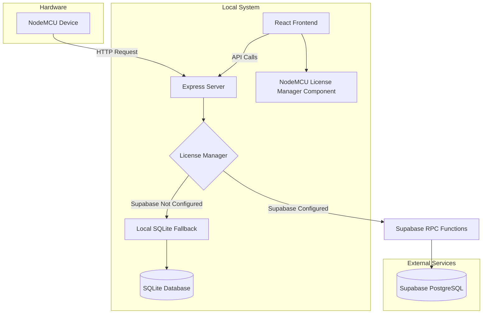
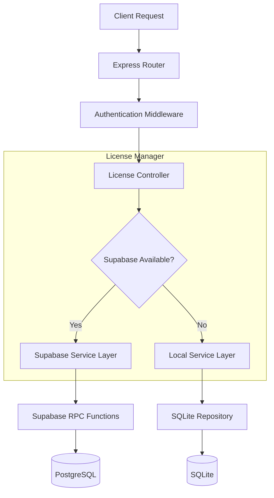
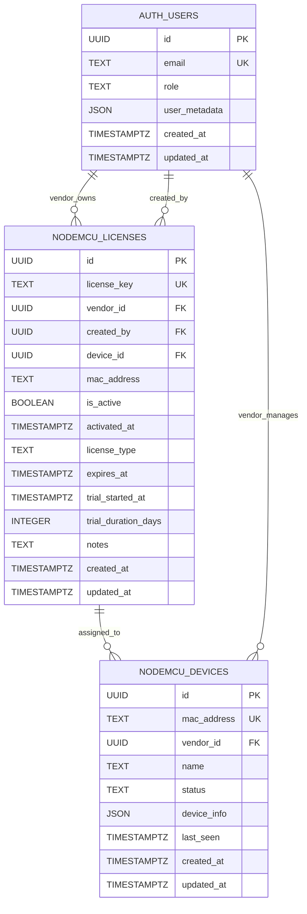

## 1. Architecture Design



## 2. Technology Description

- **Frontend**: React@18 + TypeScript + TailwindCSS@3 + Vite
- **Backend**: Express@4 + Node.js + Socket.io
- **Database**: Supabase (PostgreSQL) + SQLite fallback
- **License Manager**: Custom TypeScript class with Supabase integration
- **Initialization Tool**: vite-init

## 3. Route Definitions

| Route | Purpose |
|-------|---------|
| /api/nodemcu/license/status/:macAddress | Check license status for specific MAC address |
| /api/nodemcu/license/activate | Activate license key for device |
| /api/nodemcu/license/trial | Start 7-day trial for device |
| /api/nodemcu/license/revoke | Revoke license from device |
| /api/nodemcu/license/generate | Generate new license keys (superadmin only) |
| /api/nodemcu/license/vendor | Get all vendor licenses |

## 4. API Definitions

### 4.1 License Status Check
```
GET /api/nodemcu/license/status/:macAddress
```

Response:
```json
{
  "isValid": true,
  "isActivated": true,
  "isExpired": false,
  "licenseType": "trial",
  "expiresAt": "2024-02-15T00:00:00Z",
  "daysRemaining": 5,
  "canStartTrial": false,
  "isLocalTrial": false
}
```

### 4.2 Trial Start
```
POST /api/nodemcu/license/trial
```

Request:
```json
{
  "macAddress": "AA:BB:CC:DD:EE:FF"
}
```

Response:
```json
{
  "success": true,
  "message": "Trial started successfully",
  "trialInfo": {
    "expiresAt": "2024-02-15T00:00:00Z",
    "daysRemaining": 7
  }
}
```

## 5. Server Architecture Diagram



## 6. Data Model

### 6.1 Database Entities



### 6.2 Data Definition Language

#### NodeMCU Licenses Table
```sql
-- Create table
CREATE TABLE nodemcu_licenses (
    id UUID PRIMARY KEY DEFAULT gen_random_uuid(),
    license_key TEXT UNIQUE NOT NULL,
    vendor_id UUID REFERENCES auth.users(id) ON DELETE SET NULL,
    created_by UUID REFERENCES auth.users(id),
    device_id UUID REFERENCES nodemcu_devices(id) ON DELETE SET NULL,
    mac_address TEXT,
    is_active BOOLEAN DEFAULT false,
    activated_at TIMESTAMPTZ,
    license_type TEXT DEFAULT 'standard' CHECK (license_type IN ('trial', 'standard', 'premium')),
    expires_at TIMESTAMPTZ,
    trial_started_at TIMESTAMPTZ,
    trial_duration_days INTEGER DEFAULT 7,
    notes TEXT,
    created_at TIMESTAMPTZ DEFAULT now(),
    updated_at TIMESTAMPTZ DEFAULT now()
);

-- Create indexes
CREATE INDEX idx_nodemcu_licenses_vendor_id ON nodemcu_licenses(vendor_id);
CREATE INDEX idx_nodemcu_licenses_device_id ON nodemcu_licenses(device_id);
CREATE INDEX idx_nodemcu_licenses_mac_address ON nodemcu_licenses(mac_address);
CREATE INDEX idx_nodemcu_licenses_active ON nodemcu_licenses(is_active);
CREATE INDEX idx_nodemcu_licenses_type ON nodemcu_licenses(license_type);

-- Enable RLS
ALTER TABLE nodemcu_licenses ENABLE ROW LEVEL SECURITY;

-- Grant permissions
GRANT SELECT ON nodemcu_licenses TO anon;
GRANT ALL PRIVILEGES ON nodemcu_licenses TO authenticated;
```

#### Core RPC Functions
```sql
-- Check license status
CREATE OR REPLACE FUNCTION check_nodemcu_license_status(
  device_mac_address TEXT
)
RETURNS JSON AS $$
DECLARE
  license_record RECORD;
  device_record RECORD;
  days_remaining INTEGER;
  is_expired BOOLEAN;
BEGIN
  -- Get device
  SELECT * INTO device_record
  FROM nodemcu_devices
  WHERE mac_address = device_mac_address;

  IF NOT FOUND THEN
    RETURN json_build_object(
      'success', false,
      'error', 'Device not found'
    );
  END IF;

  -- Get active license
  SELECT * INTO license_record
  FROM nodemcu_licenses
  WHERE device_id = device_record.id 
    AND is_active = true
  ORDER BY activated_at DESC
  LIMIT 1;

  IF NOT FOUND THEN
    RETURN json_build_object(
      'success', true,
      'has_license', false,
      'has_trial', false,
      'can_start_trial', true,
      'message', 'No license found, trial available'
    );
  END IF;

  -- Calculate expiration
  IF license_record.expires_at IS NOT NULL THEN
    days_remaining := GREATEST(0, EXTRACT(DAY FROM (license_record.expires_at - now()))::INTEGER);
    is_expired := license_record.expires_at < now();
  ELSE
    days_remaining := NULL;
    is_expired := false;
  END IF;

  RETURN json_build_object(
    'success', true,
    'has_license', true,
    'is_active', license_record.is_active,
    'is_expired', is_expired,
    'license_key', license_record.license_key,
    'license_type', license_record.license_type,
    'expires_at', license_record.expires_at,
    'days_remaining', days_remaining,
    'can_start_trial', false
  );
END;
$$ LANGUAGE plpgsql SECURITY DEFINER;

-- Start trial function
CREATE OR REPLACE FUNCTION start_nodemcu_trial(
  device_mac_address TEXT,
  vendor_id_param UUID DEFAULT NULL
)
RETURNS JSON AS $$
DECLARE
  trial_license RECORD;
  device_record RECORD;
  vendor_uuid UUID;
BEGIN
  IF vendor_id_param IS NULL THEN
    vendor_uuid := auth.uid();
  ELSE
    vendor_uuid := vendor_id_param;
  END IF;

  -- Get device
  SELECT * INTO device_record 
  FROM nodemcu_devices 
  WHERE mac_address = device_mac_address 
    AND vendor_id = vendor_uuid;

  IF NOT FOUND THEN
    RETURN json_build_object(
      'success', false,
      'error', 'Device not found or does not belong to you'
    );
  END IF;

  -- Check existing license
  SELECT * INTO trial_license
  FROM nodemcu_licenses
  WHERE device_id = device_record.id 
    AND is_active = true;

  IF FOUND THEN
    RETURN json_build_object(
      'success', false,
      'error', 'Device already has an active license'
    );
  END IF;

  -- Check previous trial
  SELECT * INTO trial_license
  FROM nodemcu_licenses
  WHERE device_id = device_record.id 
    AND license_type = 'trial';

  IF FOUND THEN
    RETURN json_build_object(
      'success', false,
      'error', 'Device already had a trial period'
    );
  END IF;

  -- Create trial license
  INSERT INTO nodemcu_licenses (
    license_key, vendor_id, created_by, device_id, mac_address,
    is_active, activated_at, license_type, trial_started_at,
    trial_duration_days, expires_at
  ) VALUES (
    'TRIAL-' || device_mac_address || '-' || substring(md5(random()::text) from 1 for 6),
    vendor_uuid, auth.uid(), device_record.id, device_mac_address,
    true, now(), 'trial', now(), 7, now() + interval '7 days'
  );

  RETURN json_build_object(
    'success', true,
    'message', 'Trial started successfully',
    'license_key', 'TRIAL-' || device_mac_address,
    'expires_at', now() + interval '7 days',
    'days_remaining', 7
  );
END;
$$ LANGUAGE plpgsql SECURITY DEFINER;
```